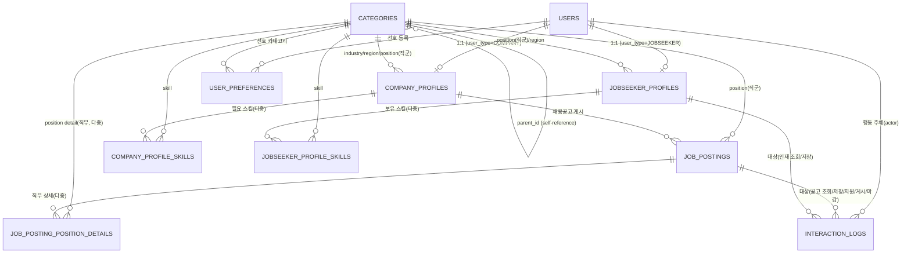

# DB 설계 문서 (Supabase / PostgreSQL)

> 본 문서는 [`PRD.md`](./PRD.md)를 기반으로 작성된 데이터베이스 설계 문서입니다. 백엔드는 Supabase(Postgres)를 사용하며, 모든 DB 접근은 `@supabase/supabase-js` 클라이언트를 통해서만 이루어짐을 전제로 합니다.
>
> 아직 실제 마이그레이션(SQL/Supabase CLI)은 적용하지 않았으며, 본 문서는 설계 단계 산출물입니다.

## 1. 공통 규칙

- 모든 테이블의 PK는 `uuid` 타입이며 기본값은 `gen_random_uuid()`를 사용한다 (Supabase는 `pgcrypto` 확장이 기본 활성화되어 있음).
- 사용자 인증은 Supabase Auth(`auth.users`)가 담당하고, 애플리케이션 도메인 테이블인 `public.users`는 `auth.users(id)`를 참조하는 1:1 확장 테이블로 둔다.
- 시각 컬럼은 `timestamptz`를 사용하고, 생성 시각은 `created_at`, 수정 시각은 `updated_at`으로 통일한다.
- 테이블/컬럼명은 `snake_case`를 사용한다.
- 카테고리(업종/직무/스킬/지역)는 자유 텍스트가 아닌 `categories` 테이블의 FK로만 저장한다 (PRD 3장). 고용형태는 카테고리가 아니라 평면 문자열 컬럼(`employment_type`)으로 각 테이블에 직접 둔다 (아래 "원티드 API 변수명 통일 원칙" 참고).
- 가입 폼의 카테고리 입력값(업종/직무/스킬/지역)은 프런트엔드에서 `categories` 테이블 조회 결과(select/autocomplete)로만 선택 가능해야 하며, 자유 텍스트 입력 필드를 두지 않는다 (PRD 2장).
- Supabase Auth의 이메일 컨펌(Email Confirmations)은 비활성화한다 — 가입 시 별도 인증 메일 없이 가입 직후 세션이 즉시 활성화된다 (PRD 2장).
- Row Level Security(RLS) 정책은 별도 문서에서 다루며, 본 문서는 테이블/컬럼/제약조건 설계에 집중한다.

### 1.1 원티드 API 변수명 통일 원칙

원티드(Wanted) API를 통해 실제 공고/기업 데이터를 가져올 예정이므로(PRD 3장), 원티드 API에 동일한 개념의 필드가 있으면 **컬럼명·값을 그대로 가져와 통일**하고, 원티드 API에 대응 필드가 없는 경우에만 기존(=API에서 온) 변수를 조합해 값을 산출한다. 새로운 독립 변수를 임의로 만들지 않는다. 구체적으로:

- `categories.title`(원티드 `TagResponseSerializer.title`), `categories.tag_id`(원티드 태그의 원본 정수 ID), `categories.ksic_code`/`categories.industry_code`(INDUSTRY 전용, `/insight/company` 응답 필드명), `categories.location_code`(REGION 전용, 동일 응답 필드명) — 모두 원티드 응답 필드명과 동일하게 명명한다 (3.2절).
- 고용형태는 원티드에서 `employment_type`(`ATSEmploymentTypeEnum`: `regular`/`contract`/`intern`)이라는 평면 문자열이므로, `categories` 테이블에 넣지 않고 `company_profiles`/`jobseeker_profiles`/`job_postings`에 동일한 이름·값의 컬럼으로 직접 둔다.
- `job_postings.position_category_id`, `annual_from`/`annual_to`, `status`(`draft`/`active`/`close`)는 원티드 ATS 공고 스키마(`ATSPositionCreateSerializer`, `JobStatusEnum`)의 필드명·값과 동일하게 맞춘다 (3.9절).
- 원티드 공고 스키마에는 급여 필드가 없으므로, `job_postings`에 급여 컬럼을 만들지 않는다. 급여가 필요한 곳은 `company_profiles.average_salary`/`hired_salary`(원티드 `/insight/company` 필드명 그대로)를 조인해서 조합한다(3.3절, 5장).
- 반대로 `users.user_type`, `jobseeker_profiles`의 전 항목(원티드 API에 구직자 개념 자체가 없음), `user_preferences`, `interaction_logs`의 `VIEW`/`SAVE`/`APPLY` 액션 등은 원티드 API에 대응 개념이 전혀 없으므로 통일 대상이 아니며, 기존 설계(자체 명명)를 그대로 유지한다.

## 2. ERD 요약

> `employment_type`(고용형태)은 원티드 API에서 계층형 카테고리가 아니라 평면 문자열이므로, 위 ERD에서 `CATEGORIES`와 연결하지 않고 `COMPANY_PROFILES`/`JOBSEEKER_PROFILES`/`JOB_POSTINGS`에 각각 직접 속성으로 둔다(1.1절).

## 3. 테이블 설계

### 3.1 `users`

회원 공통 정보. `user_type`은 가입 시 1회 결정되며 전환 불가(PRD 2장, 8장).

| 컬럼명 | 타입 | 제약조건 | 설명 |
|---|---|---|---|
| `id` | `uuid` | PK, FK → `auth.users(id)` ON DELETE CASCADE | Supabase Auth 사용자와 1:1 |
| `user_type` | `text` | NOT NULL, CHECK (`user_type` IN (`'COMPANY'`, `'JOBSEEKER'`)) | 계정당 1개 역할 고정 |
| `created_at` | `timestamptz` | NOT NULL, DEFAULT `now()` | |
| `updated_at` | `timestamptz` | NOT NULL, DEFAULT `now()` | |

> `user_type`은 앱/DB 레벨에서 생성 이후 수정 불가하도록 강제한다(3.9절 참고).

### 3.2 `categories`

업종/직무/스킬/지역을 하나의 계층형 테이블로 관리 (PRD 3장). 각 타입의 분류 기준은 원티드 공개 API 비교를 통해 구체화했다: `INDUSTRY`=KSIC 대/중/소분류, `JOB`=직군→직무 2단, `SKILL`=단일 레벨, `REGION`=시도→시군구→읍면동. 컬럼명은 원티드 응답 필드명과 통일한다(1.1절). **고용형태(`EMPLOYMENT_TYPE`)는 이 테이블에 포함하지 않는다** — 원티드 API에서 평면 문자열이므로 각 프로필/공고 테이블에 `employment_type` 컬럼으로 직접 둔다(3.3/3.5/3.9절).

| 컬럼명 | 타입 | 제약조건 | 설명 |
|---|---|---|---|
| `id` | `uuid` | PK, DEFAULT `gen_random_uuid()` | 내부 PK(우리 시스템 전용) |
| `category_type` | `text` | NOT NULL, CHECK (`category_type` IN (`'INDUSTRY'`,`'JOB'`,`'SKILL'`,`'REGION'`)) | 카테고리 종류 |
| `parent_id` | `uuid` | FK → `categories(id)` ON DELETE RESTRICT, NULL 허용 | self-reference, NULL이면 최상위(depth=1) |
| `title` | `text` | NOT NULL | 카테고리명. 원티드 `TagResponseSerializer.title`과 동일한 이름(구 `name`에서 변경) |
| `tag_id` | `integer` | NULL 허용, UNIQUE | 원티드 원본 태그 ID(`JOB`/`SKILL`에서 사용, `category_tags`/`subcategory_tags`/`skill_tags` 조회 시 그대로 사용). 원티드 태그가 아닌 자체 등록 카테고리는 NULL |
| `ksic_code` | `text` | NULL 허용 | `INDUSTRY` 전용. 한국표준산업분류 코드. 원티드 `/insight/company` 응답의 `ksic_code` 필드명 그대로 |
| `industry_code` | `text` | NULL 허용 | `INDUSTRY` 전용. KSIC보다 상위의 산업 섹션 코드(예: `"M"`). 원티드 `/insight/company` 응답의 `industry_code` 필드명 그대로 |
| `location_code` | `text` | NULL 허용 | `REGION` 전용. 법정동코드. 원티드 `/insight/company` 응답의 `location_code` 필드명 그대로 |
| `depth` | `integer` | NOT NULL, DEFAULT `1`, CHECK (`depth` BETWEEN 1 AND 3) | 3단계 제한 확정(PRD 3장/8장). `INDUSTRY`는 KSIC 세분류·세세분류(4~5단계)는 사용하지 않음 |
| `sort_order` | `integer` | NOT NULL, DEFAULT `0` | 노출 순서 |
| `created_at` | `timestamptz` | NOT NULL, DEFAULT `now()` | |
| `updated_at` | `timestamptz` | NOT NULL, DEFAULT `now()` | |

- `UNIQUE (category_type, parent_id, title)` — 같은 부모/타입 내 이름 중복 방지.
- `depth`는 `parent_id`가 가리키는 부모의 `depth + 1`과 일치해야 한다(부모-자식 depth 정합성은 CHECK만으로 표현이 불가능하므로 트리거로 강제하는 것을 전제로 설계함).
- `category_type = 'SKILL'`인 행은 `parent_id`가 항상 NULL(단일 레벨)이어야 한다 — CHECK 제약만으로는 타입별 조건부 검증이 불가능하므로, depth 정합성과 함께 트리거로 강제하는 것을 전제로 한다.
- `ksic_code`/`industry_code`는 `category_type='INDUSTRY'`, `location_code`는 `category_type='REGION'`일 때만 값을 가져야 한다(그 외 타입은 NULL) — 역시 트리거로 강제한다.

### 3.3 `company_profiles`

기업 프로필 (PRD 4.1). `users.user_type = 'COMPANY'`인 계정과 1:1.

| 컬럼명 | 타입 | 제약조건 | 설명 |
|---|---|---|---|
| `id` | `uuid` | PK, DEFAULT `gen_random_uuid()` | |
| `user_id` | `uuid` | NOT NULL, UNIQUE, FK → `users(id)` ON DELETE CASCADE | 1계정 1프로필 |
| `industry_category_id` | `uuid` | NOT NULL, FK → `categories(id)` | 업종 (`category_type='INDUSTRY'`) |
| `company_size` | `text` | NOT NULL | 기업 규모 (원티드 API 대응 없음, 자체 입력값) |
| `region_category_id` | `uuid` | NOT NULL, FK → `categories(id)` | 위치 (`category_type='REGION'`) |
| `position_category_id` | `uuid` | NOT NULL, FK → `categories(id)` | 직무 (`category_type='JOB'`). 원티드 `position_category_id`와 동일한 이름(구 `job_category_id`에서 변경) |
| `employment_type` | `text` | NOT NULL, CHECK (`employment_type` IN (`'regular'`,`'contract'`,`'intern'`)) | 고용형태. `categories` FK가 아닌 원티드 `ATSEmploymentTypeEnum`과 동일한 평면 문자열(구 `employment_type_category_id` FK에서 변경, 1.1절) |
| `average_salary` | `integer` | NULL 허용, CHECK (`average_salary` IS NULL OR `average_salary` >= 0) | 평균연봉. 원티드 `/insight/company` 응답의 `average_salary` 필드명 그대로(구 `salary_min`/`salary_max` 범위 컬럼에서 변경 — 원티드에 범위 개념이 없어 point-value로 통일) |
| `hired_salary` | `integer` | NULL 허용, CHECK (`hired_salary` IS NULL OR `hired_salary` >= 0) | 신규입사자 평균연봉. 원티드 `/insight/company` 응답의 `hired_salary` 필드명 그대로 |
| `created_at` | `timestamptz` | NOT NULL, DEFAULT `now()` | |
| `updated_at` | `timestamptz` | NOT NULL, DEFAULT `now()` | |

### 3.4 `company_profile_skills` (조인 테이블)

기업 필요 스킬(다중, PRD 4.1).

| 컬럼명 | 타입 | 제약조건 | 설명 |
|---|---|---|---|
| `company_profile_id` | `uuid` | NOT NULL, FK → `company_profiles(id)` ON DELETE CASCADE | |
| `skill_category_id` | `uuid` | NOT NULL, FK → `categories(id)` | `category_type='SKILL'` |
| `created_at` | `timestamptz` | NOT NULL, DEFAULT `now()` | |

- PK: `(company_profile_id, skill_category_id)`

### 3.5 `jobseeker_profiles`

구직자 프로필 (PRD 4.2). `users.user_type = 'JOBSEEKER'`인 계정과 1:1.

| 컬럼명 | 타입 | 제약조건 | 설명 |
|---|---|---|---|
| `id` | `uuid` | PK, DEFAULT `gen_random_uuid()` | |
| `user_id` | `uuid` | NOT NULL, UNIQUE, FK → `users(id)` ON DELETE CASCADE | 1계정 1프로필 |
| `desired_position_category_id` | `uuid` | NOT NULL, FK → `categories(id)` | 희망 직무 (`category_type='JOB'`, 구 `desired_job_category_id`에서 변경 — `company_profiles.position_category_id`와 명명 일치) |
| `career_years` | `integer` | NOT NULL, CHECK (`career_years` >= 0) | 경력 연차. 원티드 API에 구직자 개념 자체가 없어 대응 변수 없음, 자체 입력값 |
| `region_category_id` | `uuid` | NOT NULL, FK → `categories(id)` | 거주 지역 (`category_type='REGION'`) |
| `desired_salary` | `integer` | NULL 허용, CHECK (`desired_salary` IS NULL OR `desired_salary` >= 0) | 희망 연봉. 원티드 API에 구직자 개념 자체가 없어 대응 변수 없음, 자체 입력값 |
| `desired_employment_type` | `text` | NOT NULL, CHECK (`desired_employment_type` IN (`'regular'`,`'contract'`,`'intern'`)) | 희망 근무형태. `company_profiles.employment_type`과 동일한 값 집합(구 `desired_employment_type_category_id` FK에서 변경, 1.1절) |
| `is_salary_public` | `boolean` | NOT NULL, DEFAULT `true` | PRD 8장 민감정보 비공개 옵션(임시: 기본 공개) |
| `is_region_public` | `boolean` | NOT NULL, DEFAULT `true` | PRD 8장 민감정보 비공개 옵션(임시: 기본 공개) |
| `created_at` | `timestamptz` | NOT NULL, DEFAULT `now()` | |
| `updated_at` | `timestamptz` | NOT NULL, DEFAULT `now()` | |

### 3.6 `jobseeker_profile_skills` (조인 테이블)

구직자 보유 스킬(다중, PRD 4.2).

| 컬럼명 | 타입 | 제약조건 | 설명 |
|---|---|---|---|
| `jobseeker_profile_id` | `uuid` | NOT NULL, FK → `jobseeker_profiles(id)` ON DELETE CASCADE | |
| `skill_category_id` | `uuid` | NOT NULL, FK → `categories(id)` | `category_type='SKILL'` |
| `created_at` | `timestamptz` | NOT NULL, DEFAULT `now()` | |

- PK: `(jobseeker_profile_id, skill_category_id)`

### 3.7 `user_preferences`

선호 카테고리 + 가중치 (PRD 4.3).

| 컬럼명 | 타입 | 제약조건 | 설명 |
|---|---|---|---|
| `id` | `uuid` | PK, DEFAULT `gen_random_uuid()` | |
| `user_id` | `uuid` | NOT NULL, FK → `users(id)` ON DELETE CASCADE | |
| `category_id` | `uuid` | NOT NULL, FK → `categories(id)` | 선호 카테고리(타입 무관: 업종/직무/스킬/지역/고용형태) |
| `weight` | `numeric(5,2)` | NOT NULL, DEFAULT `0`, CHECK (`weight` >= 0) | 사용자별 선호 가중치 (PRD 5장 고정 스코어링 가중치와는 별개의 개인화 값) |
| `created_at` | `timestamptz` | NOT NULL, DEFAULT `now()` | |
| `updated_at` | `timestamptz` | NOT NULL, DEFAULT `now()` | |

- `UNIQUE (user_id, category_id)` — 동일 사용자-카테고리 조합 중복 방지.

### 3.8 `job_postings`

채용공고. PRD 4.5절에 정의되어 있으며, 컬럼명은 원티드 ATS 공고 생성 스키마(`ATSPositionCreateSerializer`)와 동일하게 맞춘다(1.1절 "원티드 API 변수명 통일 원칙" 참고).

| 컬럼명 | 타입 | 제약조건 | 설명 |
|---|---|---|---|
| `id` | `uuid` | PK, DEFAULT `gen_random_uuid()` | |
| `company_profile_id` | `uuid` | NOT NULL, FK → `company_profiles(id)` ON DELETE CASCADE | 게시 기업 |
| `position_category_id` | `uuid` | NOT NULL, FK → `categories(id)` | 직군 (`category_type='JOB'`, depth 1). 원티드 `position_category_id`와 동일한 이름(구 `job_category_id`에서 변경) — 직무 상세(복수)는 3.8.1절 조인 테이블 참고 |
| `employment_type` | `text` | NOT NULL, CHECK (`employment_type` IN (`'regular'`,`'contract'`,`'intern'`)) | 고용형태. 원티드 `ATSEmploymentTypeEnum`과 동일한 평면 문자열(구 `employment_type_category_id` FK에서 변경) |
| `annual_from` | `integer` | NOT NULL, DEFAULT `0`, CHECK (`annual_from` >= 0) | 최소 경력 연차 (신입 = 0). 원티드 `annual_from` 필드명 그대로(구 `career_year_min`에서 변경) — PRD 7.1 경력연차 집계용 |
| `annual_to` | `integer` | NULL 허용, CHECK (`annual_to` IS NULL OR `annual_to` >= `annual_from`) | 최대 경력 연차 (NULL이면 상한 없음). 원티드 `annual_to` 필드명 그대로(구 `career_year_max`에서 변경) |
| `status` | `text` | NOT NULL, DEFAULT `'draft'`, CHECK (`status` IN (`'draft'`,`'active'`,`'close'`)) | 공고 상태. 원티드 `JobStatusEnum` 문자열 중 3개만 채택(구 `'DRAFT'`/`'POSTED'`/`'CLOSED'`에서 원티드와 동일한 소문자 값으로 변경). 그 외 원티드 값(`request`/`archived`/`saved`/`start_wait`)은 이번 범위에서 사용하지 않음 |
| `posted_at` | `timestamptz` | NULL 허용 | 게시 시각 (`status`가 `'active'`로 전이된 시각, 7.1 월별 추이 집계 기준) |
| `closed_at` | `timestamptz` | NULL 허용, CHECK (`closed_at` IS NULL OR `posted_at` IS NULL OR `closed_at` >= `posted_at`) | 마감 시각 (`status`가 `'close'`로 전이된 시각) |
| `created_at` | `timestamptz` | NOT NULL, DEFAULT `now()` | |
| `updated_at` | `timestamptz` | NOT NULL, DEFAULT `now()` | |

> 업종은 `company_profiles.industry_category_id`를 통해 조인으로 얻는다(별도 컬럼 중복 저장하지 않음). 급여 컬럼은 두지 않는다 — 원티드 공고 생성 스키마 자체에 급여 필드가 없으므로, 급여가 필요한 곳(5장 시장분석)은 `company_profiles.average_salary`/`hired_salary`를 조인해서 조합한다. 공고 제목/본문/상세 요건 등 세부 필드는 PRD에 정의되어 있지 않아 이번 설계에서는 제외했다.

### 3.8.1 `job_posting_position_details` (조인 테이블)

공고의 직무 상세(복수, PRD 4.5절). 원티드 `position_category_detail_ids`(배열)와 동일한 개념을 조인 테이블로 표현한다.

| 컬럼명 | 타입 | 제약조건 | 설명 |
|---|---|---|---|
| `job_posting_id` | `uuid` | NOT NULL, FK → `job_postings(id)` ON DELETE CASCADE | |
| `position_detail_category_id` | `uuid` | NOT NULL, FK → `categories(id)` | `category_type='JOB'`, depth 2 (직무, `position_category_id`의 하위) |
| `created_at` | `timestamptz` | NOT NULL, DEFAULT `now()` | |

- PK: `(job_posting_id, position_detail_category_id)`

### 3.9 `interaction_logs`

조회/저장/지원 로그 (PRD 4.4) + 채용공고 게시/마감 이벤트(PRD 7.1). 대상은 채용공고 또는 구직자 프로필(인재) 둘 중 하나다.

| 컬럼명 | 타입 | 제약조건 | 설명 |
|---|---|---|---|
| `id` | `uuid` | PK, DEFAULT `gen_random_uuid()` | |
| `actor_user_id` | `uuid` | NOT NULL, FK → `users(id)` ON DELETE CASCADE | 행동 주체 |
| `action_type` | `text` | NOT NULL, CHECK (`action_type` IN (`'VIEW'`,`'SAVE'`,`'APPLY'`,`'POSTED'`,`'CLOSED'`)) | `POSTED`/`CLOSED`는 7.1절 채용공고 게시/마감 이벤트 |
| `target_job_posting_id` | `uuid` | NULL 허용, FK → `job_postings(id)` ON DELETE CASCADE | 대상이 공고인 경우 |
| `target_jobseeker_profile_id` | `uuid` | NULL 허용, FK → `jobseeker_profiles(id)` ON DELETE CASCADE | 대상이 인재(구직자)인 경우 |
| `created_at` | `timestamptz` | NOT NULL, DEFAULT `now()` | 로그 발생 시각 |

- `CHECK (num_nonnulls(target_job_posting_id, target_jobseeker_profile_id) = 1)` — 대상은 정확히 하나만 지정.

## 4. 테이블 간 관계 요약

- `users` 1 : 1 `company_profiles` (단, `user_type='COMPANY'`인 계정만)
- `users` 1 : 1 `jobseeker_profiles` (단, `user_type='JOBSEEKER'`인 계정만)
- `users` 1 : N `user_preferences`, `users` 1 : N `interaction_logs`(actor)
- `categories`는 `parent_id`로 자기 자신을 참조하는 계층형 테이블이며, `company_profiles`/`jobseeker_profiles`/`user_preferences`/`job_postings`/스킬 조인 테이블에서 FK로 참조된다. `employment_type`은 `categories`를 참조하지 않는 평면 문자열 컬럼이다(1.1절).
- `company_profiles` N : M `categories`(SKILL) → `company_profile_skills` 조인 테이블
- `jobseeker_profiles` N : M `categories`(SKILL) → `jobseeker_profile_skills` 조인 테이블
- `company_profiles` 1 : N `job_postings`
- `job_postings` N : M `categories`(JOB, 직무 상세) → `job_posting_position_details` 조인 테이블
- `job_postings` 1 : N `interaction_logs`(대상), `jobseeker_profiles` 1 : N `interaction_logs`(대상)

> 공고별 지원자 수(Tab1 공고 관리 화면)는 `job_postings`에 별도 카운터 컬럼을 두지 않고, `interaction_logs`에서
> `action_type='APPLY' AND target_job_posting_id=<공고 id>`인 행 개수를 API 응답 시점에 집계해서 내려준다
> (`backend/app/routers/job_postings.py`). 스키마에는 반영하지 않은 파생값이다.

## 5. 채용 시장 분석(P1 · v1.1) 데이터 반영 설명

PRD 7.1절의 "필요 데이터"를 다음과 같이 스키마에 반영했다.

| PRD 7.1 필요 데이터 | 반영한 테이블/컬럼 |
|---|---|
| 채용공고 게시/마감 | `job_postings.status`(`'draft'`/`'active'`/`'close'`)/`posted_at`/`closed_at` + `interaction_logs.action_type IN ('POSTED','CLOSED')` |
| Category(업종, 직무) | `job_postings.position_category_id` → `categories`(JOB), 업종은 `job_postings.company_profile_id` → `company_profiles.industry_category_id` 조인으로 조회 (KSIC 기준, `categories.ksic_code`/`categories.industry_code`) |
| 평균연봉 집계 | `job_postings`에는 급여 컬럼이 없으므로(원티드 공고 스키마에 급여 필드 없음), `company_profiles.average_salary`/`hired_salary`(원티드 `/insight/company` 필드명 그대로)를 `job_postings.company_profile_id`로 조인해 직무(`position_category_id`)·업종·월(`posted_at`) 단위로 `AVG()` 집계한다. 집계 쿼리 또는 추후 materialized view로 산출, 별도 저장 테이블은 이번 설계에 포함하지 않음 |
| 경력연차 집계 | `job_postings.annual_from/annual_to`(원티드 필드명 그대로)를 직무·업종 단위로 평균 집계 |

## 6. 미확정 이슈로 인한 임시 설계

PRD 8장의 미확정 이슈는 아래와 같이 임시값으로 스키마에 반영했다. 정책이 확정되면 본 문서와 스키마를 함께 갱신해야 한다.

| 이슈 | 임시 설계 반영 내용 |
|---|---|
| 역할 전환 정책 | `users.user_type`은 CHECK 제약으로 `COMPANY`/`JOBSEEKER`만 허용하며, 생성 이후 값을 변경하는 UPDATE 경로를 애플리케이션/RLS 정책에서 제공하지 않는 것을 전제로 설계함(역할 전환 불가 고정). |
| 가중치 자동학습 포함 여부 | `user_preferences.weight`는 사용자가 직접/시스템이 초기값으로 설정하는 정적 컬럼으로만 설계했으며, 학습 이력/모델 관련 테이블은 포함하지 않음. PRD 5장의 고정 스코어링 가중치(스킬 40% 등)는 별도 테이블 없이 애플리케이션(추천 로직) 상수로 관리한다고 가정함. |
| 카테고리 depth 제한 | `categories.depth`에 `CHECK (depth BETWEEN 1 AND 3)`로 3단계 제한을 확정했다. `INDUSTRY`(KSIC)는 대/중/소분류까지만 사용하고 세분류·세세분류(4~5단계)는 채택하지 않는다. 부모-자식 간 depth 정합성(자식 depth = 부모 depth + 1)과 `SKILL`의 단일 레벨 강제는 CHECK만으로 표현할 수 없어 트리거로 보완하는 것을 전제로 한다. |
| `REGION`/`EMPLOYMENT_TYPE` 분류 기준 | 원티드 API 비교를 통해 확정(더 이상 미확정 이슈 아님): `REGION`은 법정동코드 기준 시도/시군구/읍면동 3단계(`categories.location_code`), `EMPLOYMENT_TYPE`은 `categories` 테이블에서 아예 제외하고 원티드와 동일한 평면 문자열 컬럼(`employment_type`)으로 각 테이블에 직접 둔다(1.1절). |
| 민감정보(연봉/지역) 비공개 옵션 | `jobseeker_profiles`에 `is_salary_public`, `is_region_public` 불리언 컬럼을 추가하고 기본값은 `true`(공개)로 설정했다. 실제 비공개 토글 UI/조회 정책(RLS)은 추후 정책 확정 시 추가한다. |
| `job_postings` 엔터티 자체 | PRD 4.5절에 정의했다. 원티드 ATS 공고 생성 스키마와 동일한 컬럼명(`position_category_id`/`annual_from`/`annual_to`/`employment_type`/`status`)을 사용하도록 이번 개정에서 맞췄다(더 이상 미확정 이슈 아님). 공고 제목/본문 등 상세 필드는 PRD 확정 후 추가한다. |
| 원티드 API 변수명 통일 (신규) | 이번 개정에서 원티드 API와 동일한 개념의 필드는 컬럼명·값을 그대로 맞췄다(1.1절). API에 대응 변수가 없는 `users.user_type`, `jobseeker_profiles`의 개인 입력 필드, `user_preferences`, `interaction_logs`의 `VIEW`/`SAVE`/`APPLY` 액션은 통일 대상에서 제외하고 기존 자체 설계를 유지했다. |
